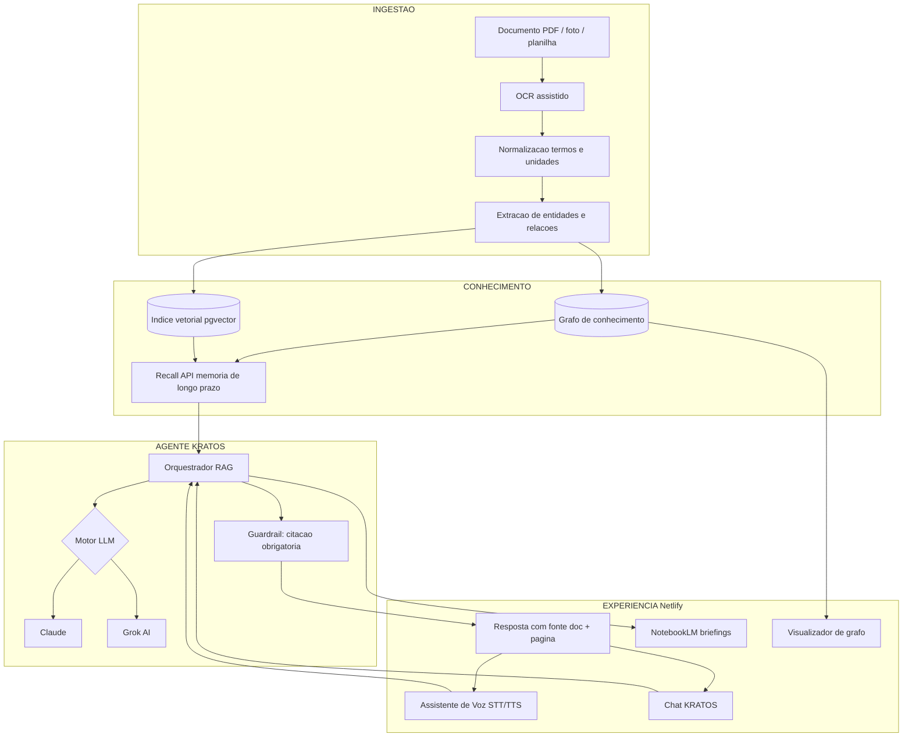

# TugGrafos

> Plataforma de conhecimento técnico para **Chefes de Máquinas**.
> Você alimenta o app com documentos; o agente **KRATOS** organiza tudo num
> **grafo de conhecimento** e responde por **voz** — sempre citando a fonte.

**TugGrafos** = *Tug* (rebocador / praça de máquinas) + *Grafos* (grafo de
conhecimento).

## O que é

Um copiloto de engenharia naval/industrial que transforma manuais, PMS,
boletins e certificados (em PDF escaneado ou foto) em conhecimento
navegável e consultável por voz:

1. **Ingestão** — upload + **OCR assistido** lê e normaliza os documentos.
2. **Organização** — **KRATOS** estrutura tudo num **grafo de conhecimento**
   (equipamento → peça → procedimento → sintoma → causa → ação), com memória
   de longo prazo via **Recall API**.
3. **Consulta** — pergunte por voz ou texto e receba a resposta **citando o
   documento e a página**.

## Tecnologias

| Peça | Papel |
|---|---|
| **KRATOS** | Agente IA orquestrador ("Chefe de Máquinas Virtual") |
| **OCR assistido** | Documento escaneado → texto técnico corrigido |
| **Grafos de conhecimento** | Relações entre equipamentos, peças e procedimentos |
| **Recall API** | Memória de longo prazo do agente |
| **NotebookLM** | Briefings e resumos em áudio por equipamento |
| **Grok AI / Claude** | Motores LLM plugáveis |
| **Assistente de Voz** | STT/TTS mãos-livres na praça de máquinas |
| **Netlify** | Hospedagem do frontend/PWA + CI/CD |
| **Supabase** | Postgres + pgvector + Auth + Storage |

## Arquitetura

## Documentação

📄 **[Proposta documental ampla](docs/proposta-tuggrafos.md)** — visão,
arquitetura, ontologia do grafo, roadmap, KPIs, riscos e conformidade.

## Princípios

- **Fonte sempre citada** (anti-alucinação): sem fonte → "não encontrado".
- **Offline-first**: funciona a bordo; sincroniza em porto.
- **Mãos-livres**: voz como interface principal.
- **Segurança**: KRATOS informa e recomenda, **nunca** aciona máquinas.
- **Privacidade**: documentos do armador não treinam modelos de terceiros.

## Licença

MIT — veja [LICENSE](LICENSE).
